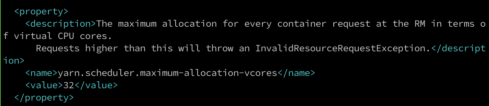

#### 1、作业一直在等待中

* 检查作业运行的宿主机资源是否足够，资源包括宿主机的系统盘大小， 内存， cpu核心数，系统盘和cpu要考虑宿主机本身占用。

####  2、提交作业失败

* 检查所在集群资源是否足够

#### 3、作业运行失败

* 作业运行失败大多数都是由于在提交界面的命令行执行的命令在容器中不存在导致的。

#### 4、提交作业时，CPU核心数超过32时，作业运行失败

* 修改集群可调度的CPU设置

```shell
vim /pai/src/hadoop-resource-manager/deploy/hadoop-resource-manager-configuration/yarn-site.xml.template

```

* 找到`yarn.scheduler.maximum-allocation-vcores`将32修改为单台计算节点最大的CPU核心数。



* 重启`hadoop-resource-manager`

```shell
./paictl.py service stop -n hadoop-resource-manager	#停止hadoop-resource-manager
kubectl get po | grep hadoop-resource-manager		#检查hadoop-resource-manager是否关闭
./paictl.py service start -n hadoop-resource-manager	#启动hadoop-resource-manager
```
