### 2、后台管理
&ensp;&ensp;SCM人工智能云平台采用轻量级 Docker 容器技术和 kubernetes 容器管理方案，实现了对 CPU、GPU、 内存、磁盘等资源的统一管理。针对人工智能领域的特定需求，提供 GPU 等异构计算资源 管理接口，实现对 GPU 等异构计算资源的虚拟化统一管理。**SCM人工智能云平台将后台管理分为以下六个模块**。

+ 集群管理
+ 集中式存储管理
+ 分布式存储管理
+ 用户管理
+ 角色管理
+ 密钥管理

#### 2.1 、集群管理
&ensp;&ensp;SCM人工智能云平台会将集群内整体资源整合成一个资源池，管理员可以根据需求使用资源池中的GPU、CPU、内存等资源创建一个或多个集群。

##### 2.1.1、新建集群

&ensp;&ensp;单击“后台管理”->“集群管理”可进入集群管理界面，用户可将资源池的资源分配出去新建集群以供使用，也可以删除集群。单击“资源分配”可弹出资源分配界面，用户可以用户可以填写相应的信息，单击确定即可分配出
相应的资源。

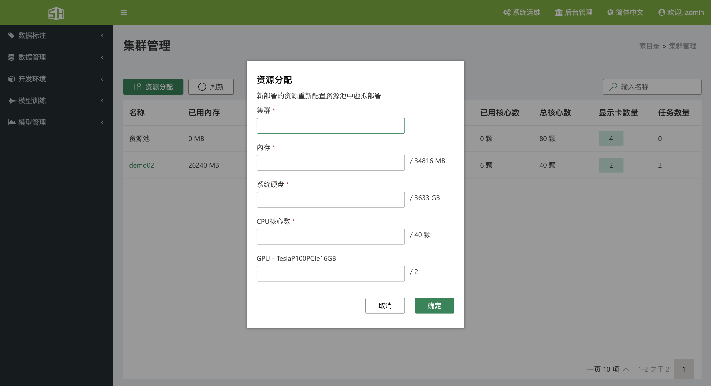

##### 2.1.2、查看集群资源状态
&ensp;&ensp;单击“后台管理”->“集群管理”可进入集群管理界面，可以观察到集群的 GPU、CPU、内存等信息，同时可以按关键字搜索集群。

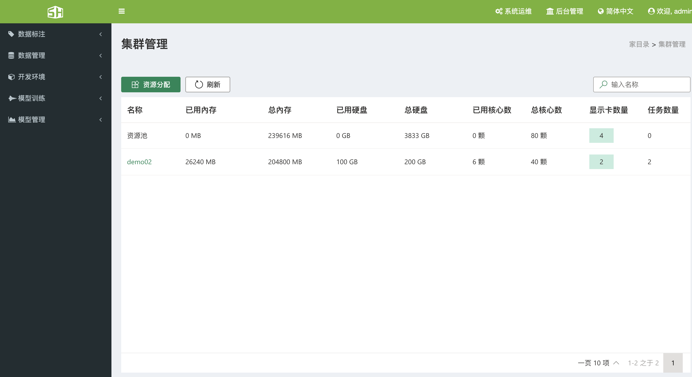

##### 2.1.3、删除集群
&ensp;&ensp;删除集群，会将集群中的资源尽数归还到资源池中，在删除过程中会弹出提示，提醒管理员是否执行此操作：
+ 1、如果此集群的仍有运行中的工作，则无法删除。
+ 2、这个集群的资源将尽数归还默认之集群。

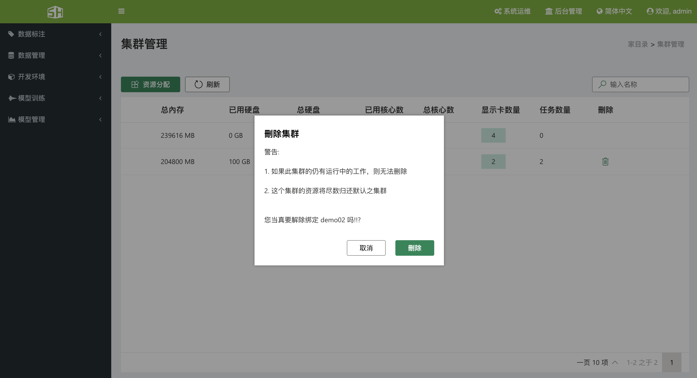

#### 2.2、集中式存储
&ensp;&ensp;SCM 人工智能云平台采用网络文件系统(Network File System，NFS)作为集中式存储，用户可以根据需求挂载局域网中主机的存储空间，支持用户存储空间的共享和私有化，方便用户之间数据的共享与隔离。

##### 2.2.1、查看集中式存储挂载信息
&ensp;&ensp;单击“后台管理”->“集中式存储管理”可进入集中式存储管理界面，可以看到已挂载存储空间的信息，名称、主机 IP、路径、可分配空间、 已用空间等信息，其中使用主机 IP+路径可以索引到确切的存储位置。

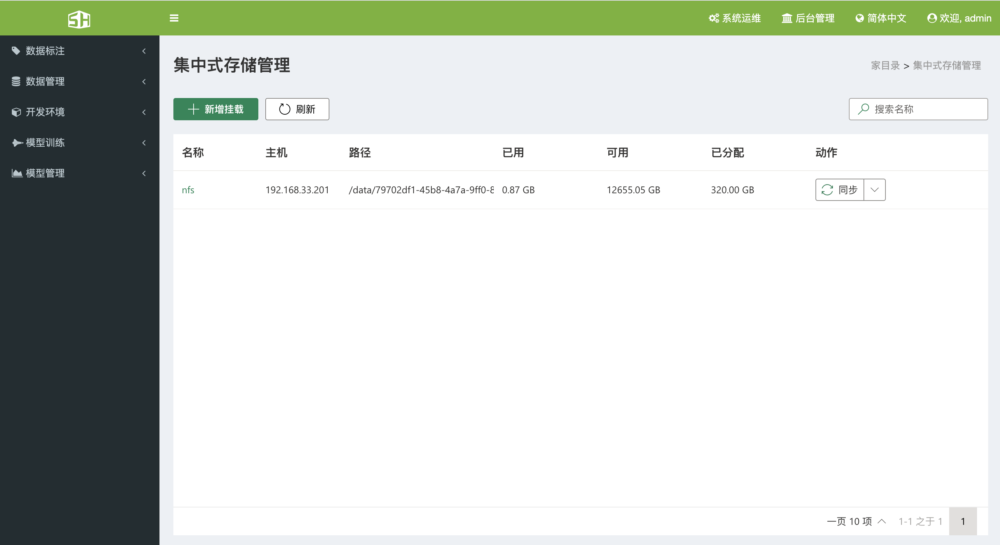

##### 2.2.2、新增挂载
&ensp;&ensp;在集中式存储管理界面，点击新增挂载，会弹出页面，填写相应的页面点击确定，即可挂载对应的硬盘空间。

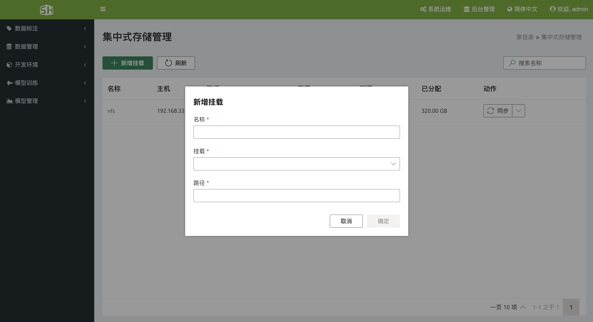

##### 2.2.3、删除挂载
&ensp;&ensp;系统管理员可以删除挂载点，删除时会删除所有数据，谨慎操作

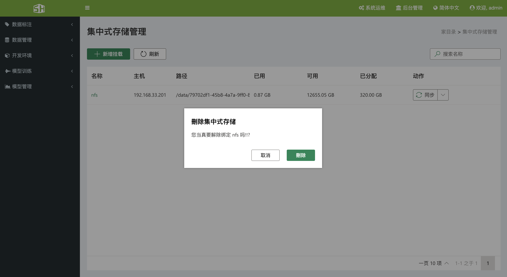

##### 2.2.4、查看管理员为用户分配的用户挂载点
&ensp;&ensp;在集中式存储管理页面，确认已经挂载好存储后，点击挂载的名称(绿色文字)，会跳转到分配挂载点的页面，可以看到为用户分配的挂载点名称、空间大小、已经空间、可以使用的空间，动作等信息。

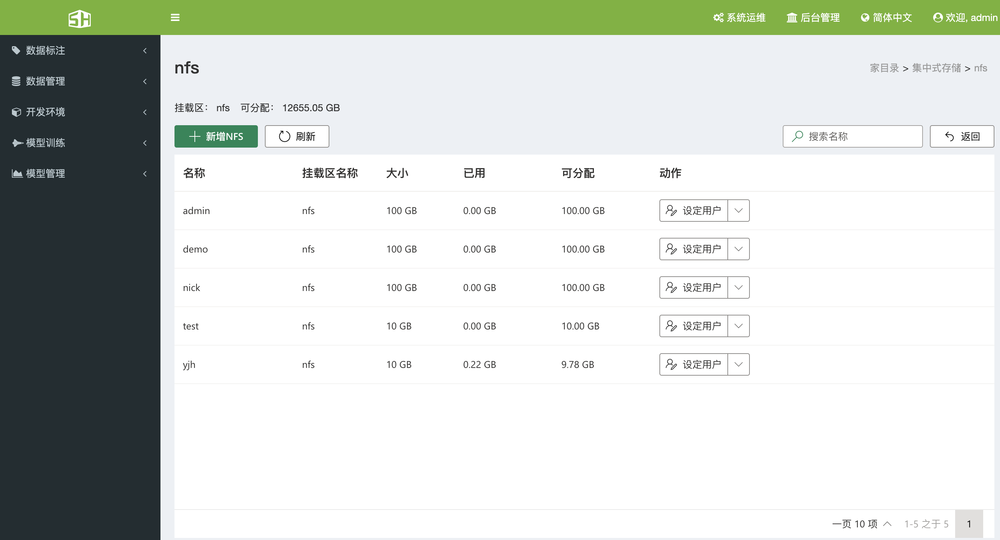

##### 2.2.5、为用户分配挂载点
&ensp;&ensp;点击新增NFS，为用户分配挂载点，填写相应的信息，可以勾选共用，表示所有人都可以看见相应的挂载点。(需要注意的是：空间的单位为GB)

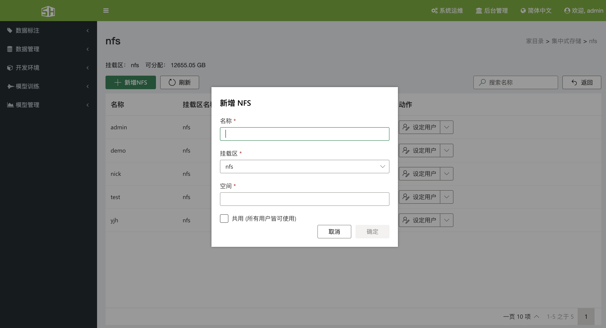

##### 2.2.6、为挂载点分配多个用户
&ensp;&ensp;系统管理员可以将创建的挂载点分配给其他人使用，点击设定用户，可以选择是否是共用的，还有就是可以选择相应的用户。

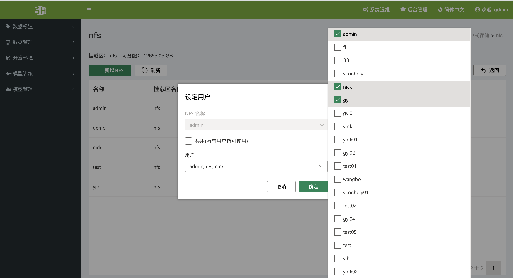

##### 2.2.7、删除挂载点
&ensp;&ensp;在动作下有下拉菜单，点击下拉菜单，会出现删除选项，点击删除选项，会删除相应的空间。谨慎操作：此操作会删除用户数据。

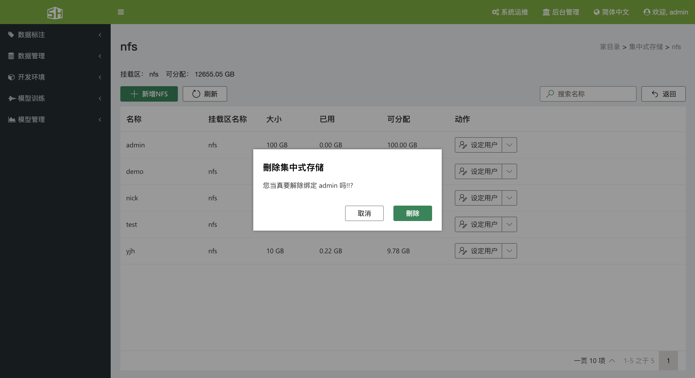

#### 2.3、分布式存储

#### 2.4、用户管理

&ensp;&ensp;系统支持管理员和普通用户两种角色用户，管理员可以为普通用户创建一个或多个独立的 GPU 集群环境，并可以限制 CPU、GPU、内存等资源量的大小，将资源分割成多个独立的集群，方便为多个部门提供服务。管理用
户管理功能主要有以下功能。

+ 新增用户

+ 查看用户信息

+ 修改用户信息

+ 删除用户

##### 2.4.1、新增用户
###### 2.4.1.1、单个增加用户
&ensp;&ensp;在用户管理界面，点击新增用户会弹出新增用户窗口，填写详细信息后，点击确定，会弹出成功提示。

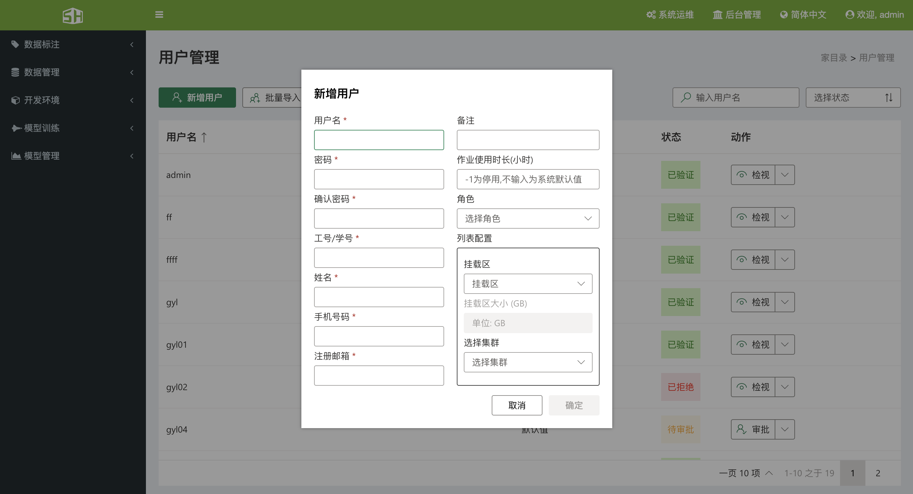

###### 2.4.1.2、批量增加用户
&ensp;&ensp;在用户管理界面，点击批量导入的下拉菜单，会看到下载模版的选项，点击下载模版，在模版中填写相应的信息后，点击批量导入，选择刚刚填写的模版文件，平台会自动导入用户，对有问题的字段，会弹出相应的提示
。

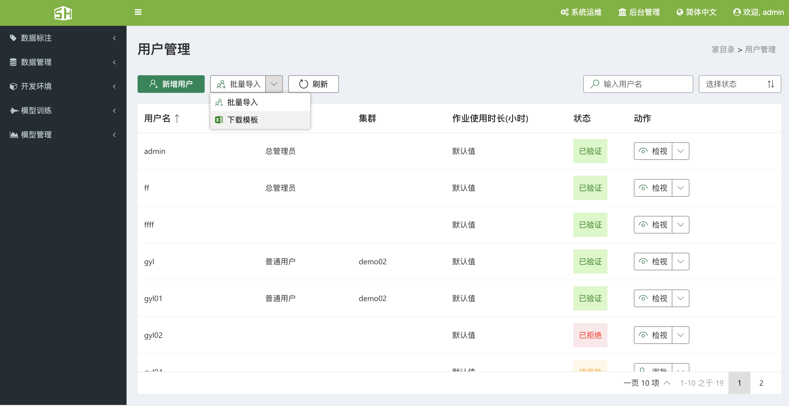

##### 2.4.2、查看用户
&ensp;&ensp;在用户管理界面，可以查看用户是否为管理员、所使用的集群等信息、用户的状态等信息。

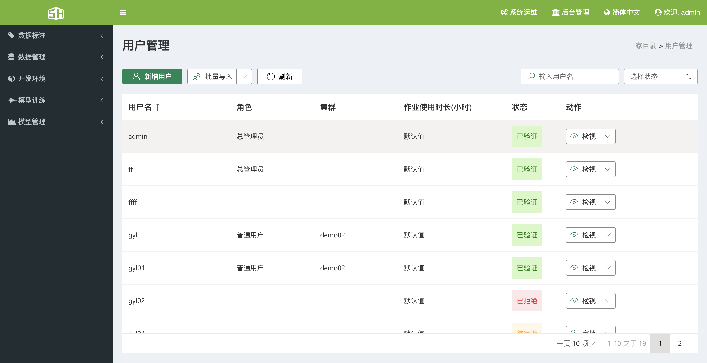

##### 2.4.3、查看用户详细信息
&ensp;&ensp;在用户管理界面，点击检视，即可查看用户详细信息。

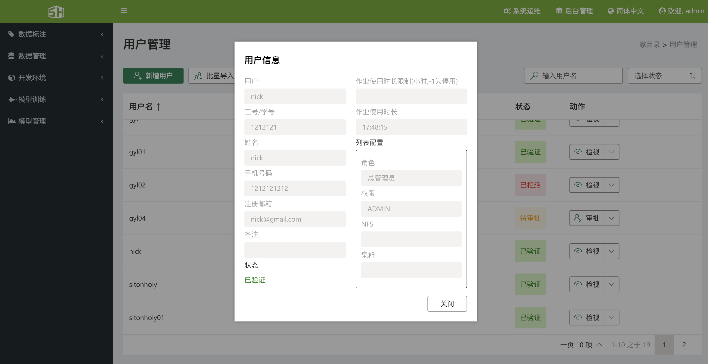

##### 2.4.4、编辑用户信息
&ensp;&ensp;在用户管理界面，点击动作的下拉菜单，点击修改，可以修改用户的具体信息，注意：用户名无法修改。

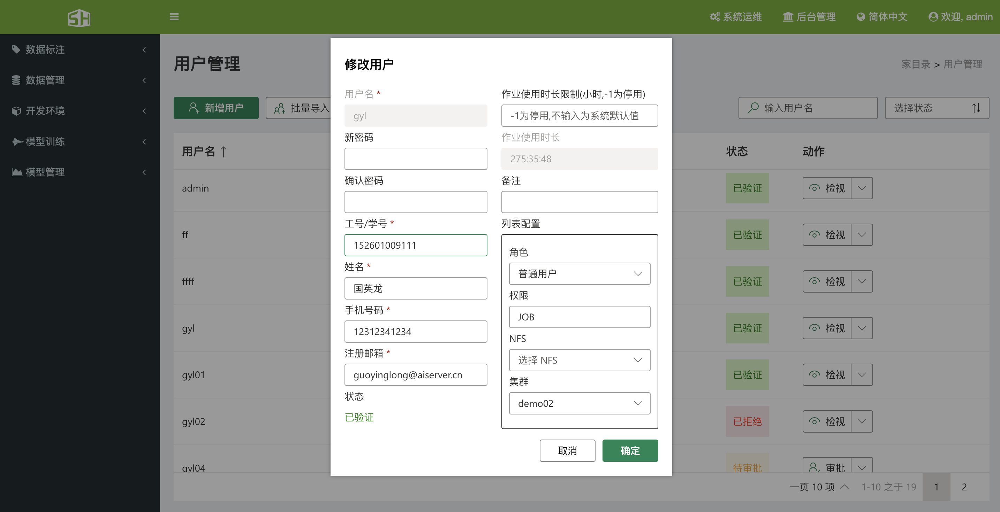

##### 2.4.5、删除用户
&ensp;&ensp;在用户管理界面，点击动作的下拉菜单，点击删除，即可将选择的用户删除。

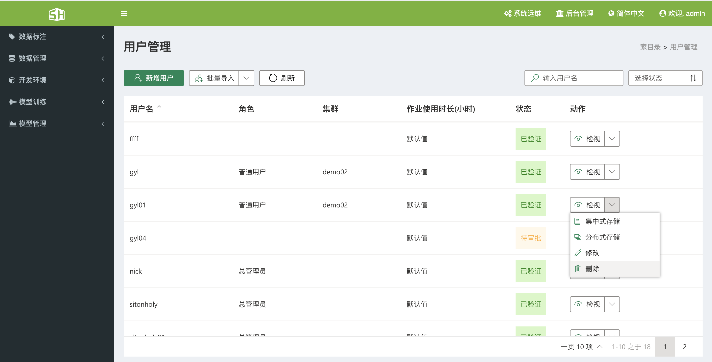

##### 2.4.6、审批用户
&ensp;&ensp;在用户管理界面，点击审批按钮，会弹出审批窗口，管理员可以为用户选择相应的权限，也可以拒绝用户。

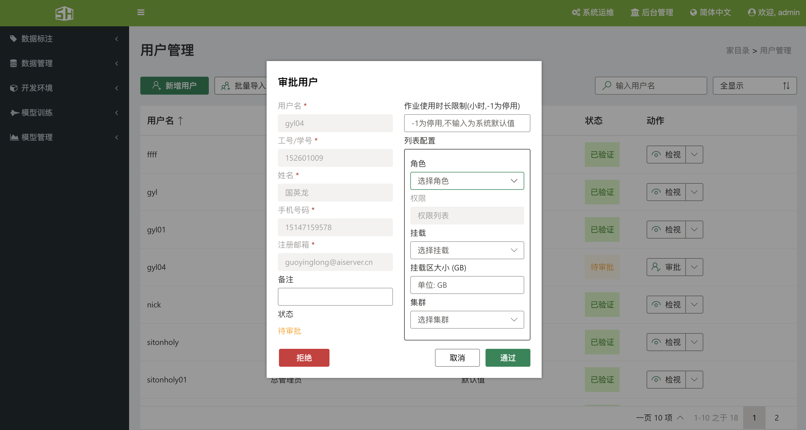

#### 2.5、角色管理
&ensp;&ensp;SCM人工智能云平台支持8种权限划分，系统管理员可以根据相应的权限，划分相应的角色，默认角色为总管理员和普通用户。

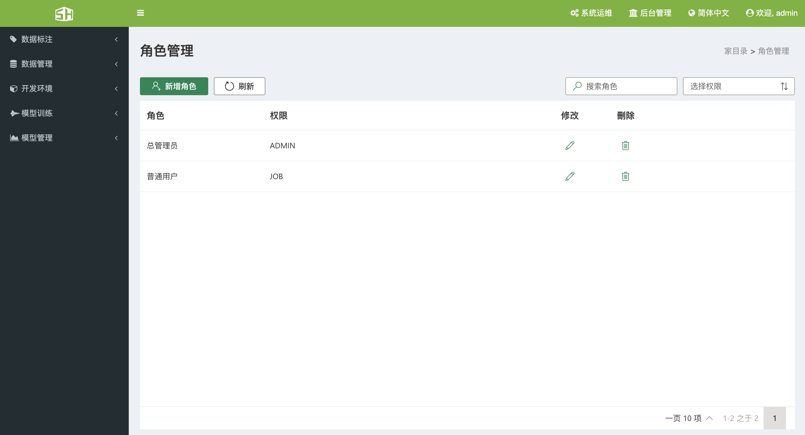

#### 2.6、密钥管理
&ensp;&ensp;单击“后台管理”->“秘钥管理”可查看 License 的状态，包括到期时间、显卡限制、显卡数量、状态信息等。

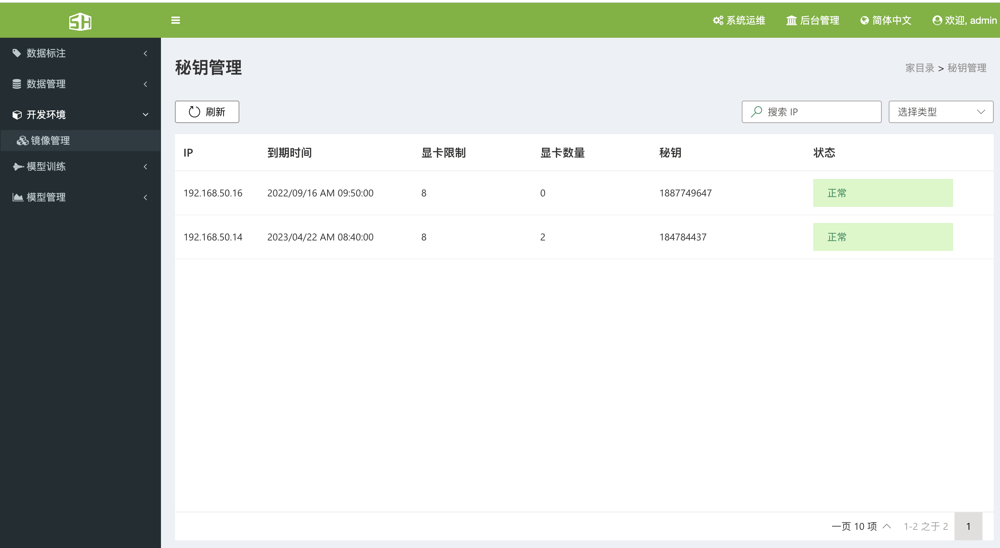