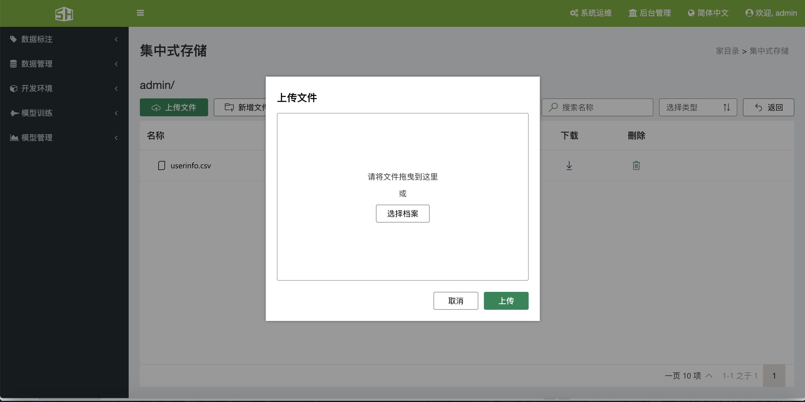

### 1、登录和首页
&ensp;&ensp;SCM人工智能云平台(版本：V4.0) 是基于 BS 模式实现的，因此访问 SCM人工智能云平台，本机需要装有浏览器（强烈推荐使用浏览器Chrome）。在保证本机与集群网络连通的情况下，在浏览器的地址栏输入主节点的 IP地址，即可访问 SCM 所提供的服务。
&ensp;&ensp;目前SCM人工智能云平台支持四种语言：简体中文、繁体中文、英语、日本语。

&ensp;&ensp;打开登录界面后，输入用户名和密码，即可进入SCM人工智能云平台，从V4.0版本开始，支持用户线上注册功能，用户注册成功后，需要管理员用户审批通过后才可以正常使用SCM人工智能云平台。

&ensp;&ensp;用户登录成功以后，会自动跳转到首页。页面将会分为三个区域：黑色部分为作业菜单栏(所有用户都能看见)、绿色部分为管理员菜单栏、其余为显示栏。
+ &ensp;&ensp;作业菜单栏部分，主要分为5个模块：数据标注、数据管理、开发环境、模型训练、模型管理。
+ &ensp;&ensp;管理员菜单部分，主要分两个部分：系统运维、后台管理。
+ 首页显示栏部分，主要分为3部分：作业状态、快速启动、集群状态。

### 2、后台管理
&ensp;&ensp;SCM人工智能云平台采用轻量级 Docker 容器技术和 kubernetes 容器管理方案，实现了对 CPU、GPU、 内存、磁盘等资源的统一管理。针对人工智能领域的特定需求，提供 GPU 等异构计算资源 管理接口，实现对 GPU 等异构计算资源的虚拟化统一管理。**SCM人工智能云平台将后台管理分为以下六个模块**。 
+ 集群管理
+ 集中式存储管理
+ 分布式存储管理
+ 用户管理
+ 角色管理
+ 密钥管理

#### 2.1 、集群管理
&ensp;&ensp;SCM人工智能云平台会将集群内整体资源整合成一个资源池，管理员可以根据需求使用资源池中的GPU、CPU、内存等资源创建一个或多个集群。

##### 2.1.1、新建集群

&ensp;&ensp;单击“后台管理”->“集群管理”可进入集群管理界面，用户可将资源池的资源分配出去新建集群以供使用，也可以删除集群。单击“资源分配”可弹出资源分配界面，用户可以用户可以填写相应的信息，单击确定即可分配出相应的资源。

##### 2.1.2、查看集群资源状态
&ensp;&ensp;单击“后台管理”->“集群管理”可进入集群管理界面，可以观察到集群的 GPU、CPU、内存等信息，同时可以按关键字搜索集群。

##### 2.1.3、删除集群
&ensp;&ensp;删除集群，会将集群中的资源尽数归还到资源池中，在删除过程中会弹出提示，提醒管理员是否执行此操作：
+ 1、如果此集群的仍有运行中的工作，则无法删除。
+ 2、这个集群的资源将尽数归还默认之集群。

#### 2.2、集中式存储
&ensp;&ensp;SCM 人工智能云平台采用网络文件系统(Network File System，NFS)作为集中式存储，用户可以根据需求挂载局域网中主机的存储空间，支持用户存储空间的共享和私有化，方便用户之间数据的共享与隔离。

##### 2.2.1、查看集中式存储挂载信息
&ensp;&ensp;单击“后台管理”->“集中式存储管理”可进入集中式存储管理界面，可以看到已挂载存储空间的信息，名称、主机 IP、路径、可分配空间、 已用空间等信息，其中使用主机 IP+路径可以索引到确切的存储位置。

##### 2.2.2、新增挂载
&ensp;&ensp;在集中式存储管理界面，点击新增挂载，会弹出页面，填写相应的页面点击确定，即可挂载对应的硬盘空间。

##### 2.2.3、删除挂载
&ensp;&ensp;系统管理员可以删除挂载点，删除时会删除所有数据，谨慎操作

##### 2.2.4、查看管理员为用户分配的用户挂载点
&ensp;&ensp;在集中式存储管理页面，确认已经挂载好存储后，点击挂载的名称(绿色文字)，会跳转到分配挂载点的页面，可以看到为用户分配的挂载点名称、空间大小、已经空间、可以使用的空间，动作等信息。

##### 2.2.5、为用户分配挂载点
&ensp;&ensp;点击新增NFS，为用户分配挂载点，填写相应的信息，可以勾选共用，表示所有人都可以看见相应的挂载点。(需要注意的是：空间的单位为GB)

##### 2.2.6、为挂载点分配多个用户
&ensp;&ensp;系统管理员可以将创建的挂载点分配给其他人使用，点击设定用户，可以选择是否是共用的，还有就是可以选择相应的用户。

##### 2.2.7、删除挂载点
&ensp;&ensp;在动作下有下拉菜单，点击下拉菜单，会出现删除选项，点击删除选项，会删除相应的空间。谨慎操作：此操作会删除用户数据。

#### 2.3、分布式存储

#### 2.4、用户管理

&ensp;&ensp;系统支持管理员和普通用户两种角色用户，管理员可以为普通用户创建一个或多个独立的 GPU 集群环境，并可以限制 CPU、GPU、内存等资源量的大小，将资源分割成多个独立的集群，方便为多个部门提供服务。管理用户管理功能主要有以下功能。
+ 新增用户

+ 查看用户信息

+ 修改用户信息

+ 删除用户

##### 2.4.1、新增用户
###### 2.4.1.1、单个增加用户
&ensp;&ensp;在用户管理界面，点击新增用户会弹出新增用户窗口，填写详细信息后，点击确定，会弹出成功提示。

###### 2.4.1.2、批量增加用户
&ensp;&ensp;在用户管理界面，点击批量导入的下拉菜单，会看到下载模版的选项，点击下载模版，在模版中填写相应的信息后，点击批量导入，选择刚刚填写的模版文件，平台会自动导入用户，对有问题的字段，会弹出相应的提示。

##### 2.4.2、查看用户
&ensp;&ensp;在用户管理界面，可以查看用户是否为管理员、所使用的集群等信息、用户的状态等信息。

##### 2.4.3、查看用户详细信息
&ensp;&ensp;在用户管理界面，点击检视，即可查看用户详细信息。

##### 2.4.4、编辑用户信息
&ensp;&ensp;在用户管理界面，点击动作的下拉菜单，点击修改，可以修改用户的具体信息，注意：用户名无法修改。

##### 2.4.5、删除用户
&ensp;&ensp;在用户管理界面，点击动作的下拉菜单，点击删除，即可将选择的用户删除。

##### 2.4.6、审批用户
&ensp;&ensp;在用户管理界面，点击审批按钮，会弹出审批窗口，管理员可以为用户选择相应的权限，也可以拒绝用户。

#### 2.5、角色管理
&ensp;&ensp;SCM人工智能云平台支持8种权限划分，系统管理员可以根据相应的权限，划分相应的角色，默认角色为总管理员和普通用户。

#### 2.6、密钥管理
&ensp;&ensp;单击“后台管理”->“秘钥管理”可查看 License 的状态，包括到期时间、显卡限制、显卡数量、状态信息等。

### 3、数据标注
&ensp;&ensp;开发中，敬请期待！！！

### 4、数据管理

&ensp;&ensp;SCM人工智能云平台，为用户提供了方便的数据管理功能，用户可以很方便的通过SCM人工智能云平台访问存储中的文件，同时支持 infiniband 高速通信，其过程与访问本地存储时一样简单快速。
&ensp;&ensp;点击“数据管理“->“集中式存储“可看到当前用户的所有挂载区，点击NFS名称，可进入具体的操作页面。

#### 4.1、集中式存储

##### 4.1.1、查看

&ensp;&ensp;单击“数据管理”->“集中式存储”可进入当前用户的集中式存储操作界面。

##### 4.1.2、文件上传

&ensp;&ensp;在集中式存储界面点击名称，即可跳转到详细页面，在此页面中，点击上传文件，会弹出文件上传页面，可以点击选择档案或者将文件拖拽到文件上传页面，然后点击确定。

#####  4.1.3、文件删除

&ensp;&ensp;在集中式存储的详细页面，点击删除按钮，即可删除当前文件。

##### 4.1.4、文件解压缩

&ensp;&ensp;在集中式存储的详细页面，在文件名称上单击鼠标右键，选择解压缩，文件会自动在后台解压缩。

##### 4.1.5、文件下载

&ensp;在集中式存储的详细页面，点击下载按钮，即可下载对应的文件。

#### 4.2、分布式存储

##### 4.2.1、查看

&ensp;&ensp;单击“数据管理”->“分布式存储”可进入当前用户的分布式存储操作界面。

##### 4.2.2、文件上传

&ensp;&ensp;在分布式存储界面点击NFS名称，即可跳转到详细页面，在此页面中，点击上传文件，会弹出文件上传页面，可以点击选择档案或者将文件拖拽到文件上传页面，然后点击确定。

##### 4.2.3、文件删除

&ensp;&ensp;在分布式存储的详细页面，点击删除按钮，即可删除当前文件。

##### 4.2.4、文件解压缩

&ensp;&ensp;在分布式存储的详细页面，在文件名称上单击鼠标右键，选择解压缩，文件会自动在后台解压缩。

##### 4.2.5、文件下载

&ensp;&ensp;在分布式存储的详细页面，点击下载按钮，即可下载对应的文件。

### 5、开发环境

#### 5.1、镜像管理

&ensp;&ensp;SCM人工智能云平台采用 Harbor 管理镜像仓库，提供自定义开发环境的功能，用户可以将特定的开发环境封装成 Docker 镜像，上传到服务器并进行管理，待下次使用，直接启动镜像即可，快速而简单，镜像管理功能主要有以下功能。 

+ 查看项目
+ 设置访问级别
+ 删除镜像
+ 设置权限

##### 5.1.1、查看项目

&ensp;&ensp;单击“开发环境”->“镜像管理”可进入当前用户的镜像管理页面，系统管理员可以看到所有用户的项目仓库，同事还可以查看到镜像仓库的存储使用情况。

##### 5.1.2、设置项目成员

&ensp;&ensp;在镜像管理页面，点击项目名称，可以看到有三个选项：镜像仓库、成员、配置管理，点击成员，可以设置其他用户读取和写入的权限。

###### 5.1.2.1、新增成员

&ensp;&ensp;在镜像管理的项目管理页面，点击新增成员，可以选择SCM上的用户，指定为项目管理员或者是维护人员。

###### 5.1.2.2、编辑成员

&ensp;&ensp;在镜像管理的项目管理页面，选择需要修改的用户，点击编辑成员，可以选择该成员是项目管理员或者是维护人员。

###### 5.1.2.3、删除成员

&ensp;&ensp;在镜像管理的项目管理页面，选择需要删除的用户，点击删除成员，就会将该成员从此项目中移除。

##### 5.1.3、设置访问级别

&ensp;&ensp;在镜像管理页面，点击项目名称，可以看到有三个选项：镜像仓库、成员、配置管理，点击配置管理，可以设置公开还是私有.

##### 5.1.4、删除镜像

&ensp;&ensp;在仓库管理页面，选择需要删除的标签，点击删除标签，即可删除。

### 6、模型训练

#### 6.1、提交作业

#### 6.2、作业管理

&ensp;&ensp;SCM人工智能云平台提供训练作业管理功能，包括查看和修改作业运行状态（等待、运行、错误、终止、完成等）、作业快速克隆。 SCM人工智能云平台提供作业的日志查看功能，可以查看从提交作业到作业结束等所有状态的日志信息，支持训练过程中输出损失率、准确率等动态可视化监控图表，同时支持实时输出训练过程日志，并提供日志下载功能，方便用户调试。 

+ 作业信息查看及状态修改 
+ 监控作业/日志查看 
+ 高级服务（Jupyter、Tensorboard、远程桌面等）

##### 6.2.1、查看作业信息

&ensp;&ensp;点击模型训练-》作业管理进入作业管理界面，可以查看当前用户所提交的作业，以及作 业的提交时间、提交用户、运行时间、所在集群、运行状态等信息。

##### 6.2.2、**管理作业** 

&ensp;&ensp;单击动作下的按钮，可以停止作业、删除作业、设定工作时长等。

##### 6.2.3、**监控作业**、查看作业日志、高级服务

+ 单击作业名称，即可进入作业的详细信息。

+ 单击“JSON 文件”可以查看当前作业的 JSON

+ 单击“作业监控”可以以图形化的方式查看当前作业对硬件资源的使用情况。

  

+ 单击“网页 SSH”可以以 web ssh 方式进入容器 

  

+ 单击”即时改码“可即打开 Jupyter 

+ 单击”远程桌面“可以打开远程桌面 

+ 单击”日志监控“可以打开 TensorBoard 

+ 单击“SSH”可以获取连接 SSH 的密钥 

  

+ 单击"标准输出"可以查看当前作业日志，然后单击**观看完整的记录**可以查看完整的日志。 

  
  
  

### 7、模型管理
&ensp;&ensp;开发中，敬请期待！！！
### 8、系统运维

#### 8.1、硬件利用率

&ensp;&ensp;点击系统运维-》硬件利用率，可以查看当前集群内机器的CPU、内存、GPU、显存、硬盘、网络的使用情况。

#### 8.2、K8S仪表板

&ensp;&ensp;点击系统运维-》K8S仪表板，可以查看K8S的环境运行状态。

#### 8.3、集群报表

#### 8.4、登录日志

&ensp;&ensp;点击系统运维-》登录日志，可以查看用户的登录信息，包括：登录IP地址、登录状态、时间等。

#### 8.5、系统设置

##### 8.5.1、基本设置

&ensp;&ensp;此页面为全局设置，可以显示作业使用时长和预设镜像。作业显示时长填写-1为停用。

##### 8.5.2、版本日志

&ensp;&ensp;通过版本日志，可以查看当前SCM的更新状态。

