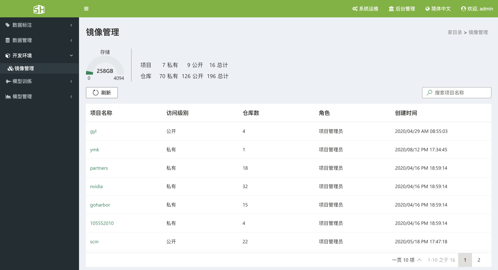
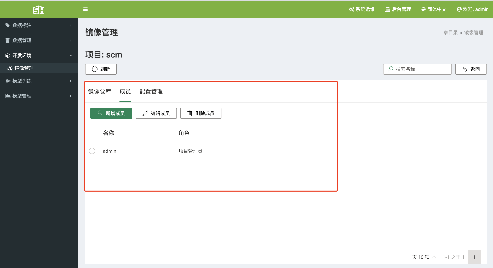
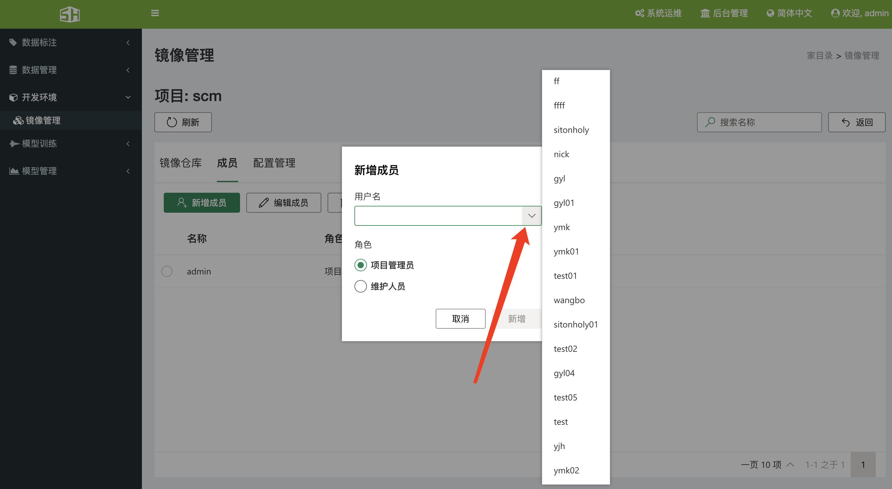
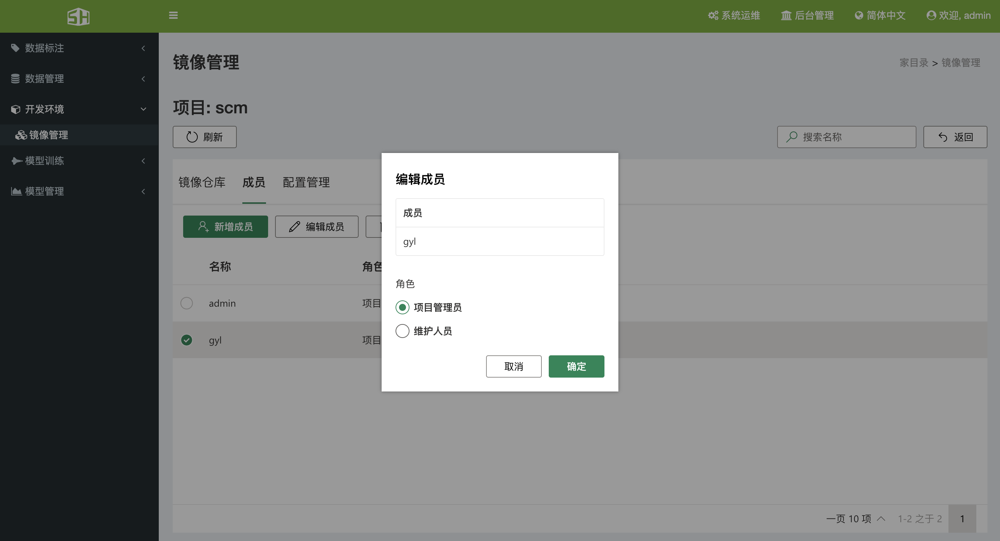
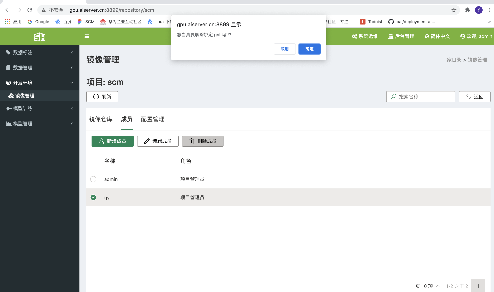
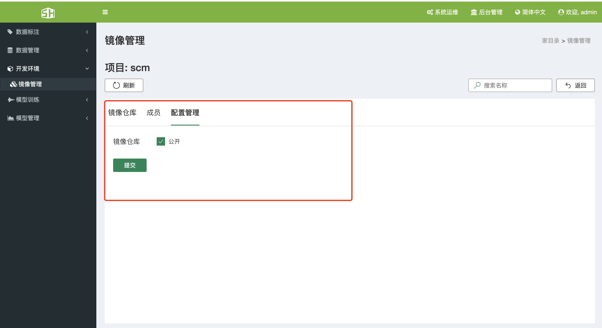
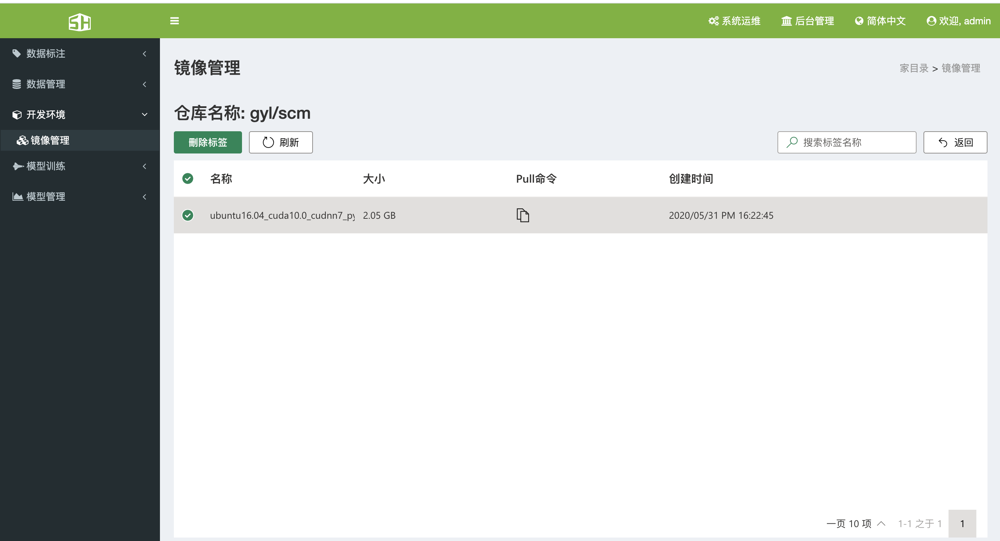

### 5、开发环境

#### 5.1、镜像管理

&ensp;&ensp;SCM人工智能云平台采用 Harbor 管理镜像仓库，提供自定义开发环境的功能，用户可以将特定的开发环境封装成 Docker 镜像，上传到服务器并进行管理，待下次使用，直接启动镜像即可，快速而简单，镜像管理功能主要有以下功能。 

+ 查看项目
+ 设置访问级别
+ 删除镜像
+ 设置权限

##### 5.1.1、查看项目

&ensp;&ensp;单击“开发环境”->“镜像管理”可进入当前用户的镜像管理页面，系统管理员可以看到所有用户的项目仓库，同事还可以查看到镜像仓库的存储使用情况。

##### 5.1.2、设置项目成员

&ensp;&ensp;在镜像管理页面，点击项目名称，可以看到有三个选项：镜像仓库、成员、配置管理，点击成员，可以设置其他用户读取和写入的权限。

###### 5.1.2.1、新增成员

&ensp;&ensp;在镜像管理的项目管理页面，点击新增成员，可以选择SCM上的用户，指定为项目管理员或者是维护人员。

###### 5.1.2.2、编辑成员

&ensp;&ensp;在镜像管理的项目管理页面，选择需要修改的用户，点击编辑成员，可以选择该成员是项目管理员或者是维护人员。

###### 5.1.2.3、删除成员

&ensp;&ensp;在镜像管理的项目管理页面，选择需要删除的用户，点击删除成员，就会将该成员从此项目中移除。

##### 5.1.3、设置访问级别

&ensp;&ensp;在镜像管理页面，点击项目名称，可以看到有三个选项：镜像仓库、成员、配置管理，点击配置管理，可以设置公开还是私有.

##### 5.1.4、删除镜像

&ensp;&ensp;在仓库管理页面，选择需要删除的标签，点击删除标签，即可删除。

