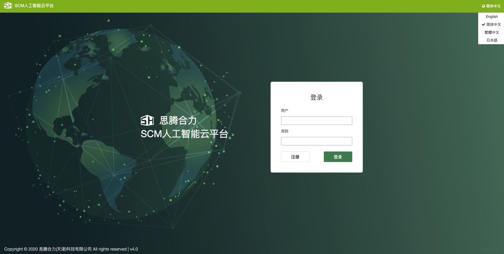
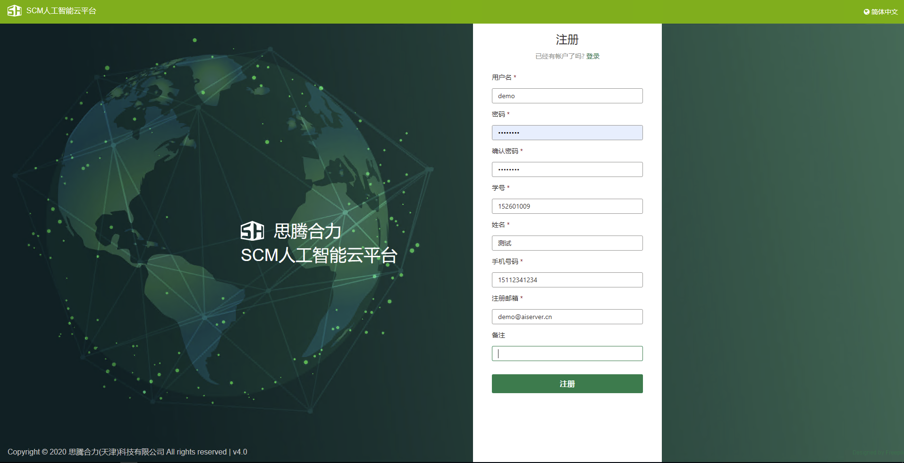
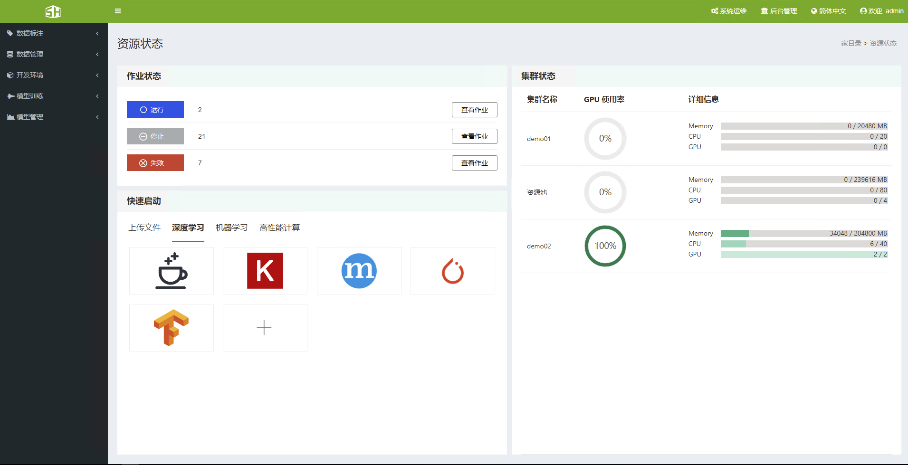

### 1、登录和首页
&ensp;&ensp;SCM人工智能云平台(版本：V4.0) 是基于 BS 模式实现的，因此访问 SCM人工智能云平台，本机需要装有浏览器（强烈推荐使用浏览器Chrome）。在保证本机与集群网络连通的情况下，在浏览器的地址栏输入主节点的 IP地址，即可访问 SCM 所提供的服务。
&ensp;&ensp;目前SCM人工智能云平台支持四种语言：简体中文、繁体中文、英语、日本语。

&ensp;&ensp;打开登录界面后，输入用户名和密码，即可进入SCM人工智能云平台，从V4.0版本开始，支持用户线上注册功能，用户注册成功后，需要管理员用户审批通过后才可以正常使用SCM人工智能云平台。

&ensp;&ensp;用户登录成功以后，会自动跳转到首页。页面将会分为三个区域：黑色部分为作业菜单栏(所有用户都能看见)、绿色部分为管理员菜单栏、其余为显示栏。

+ 作业菜单栏部分，主要分为5个模块：数据标注、数据管理、开发环境、模型训练、模型管理。
+ 管理员菜单部分，主要分两个部分：系统运维、后台管理。
+ 首页显示栏部分，主要分为3部分：作业状态、快速启动、集群状态。

