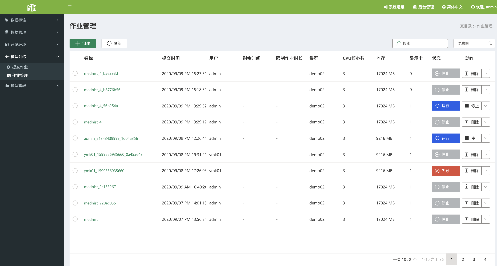
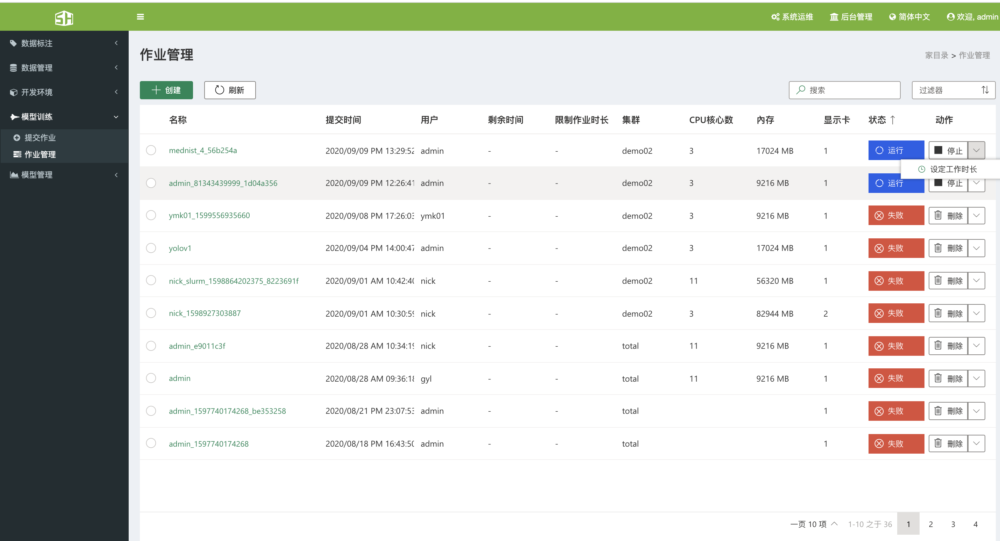
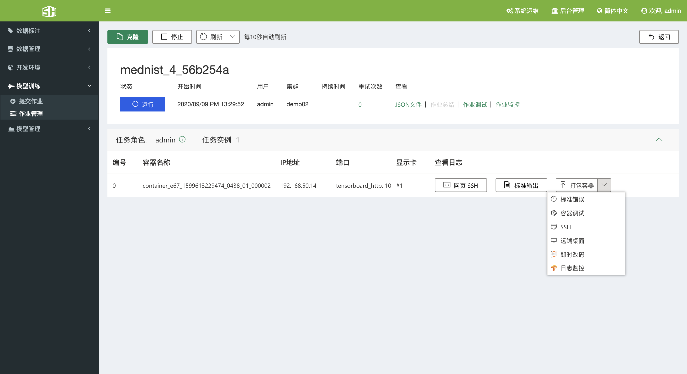
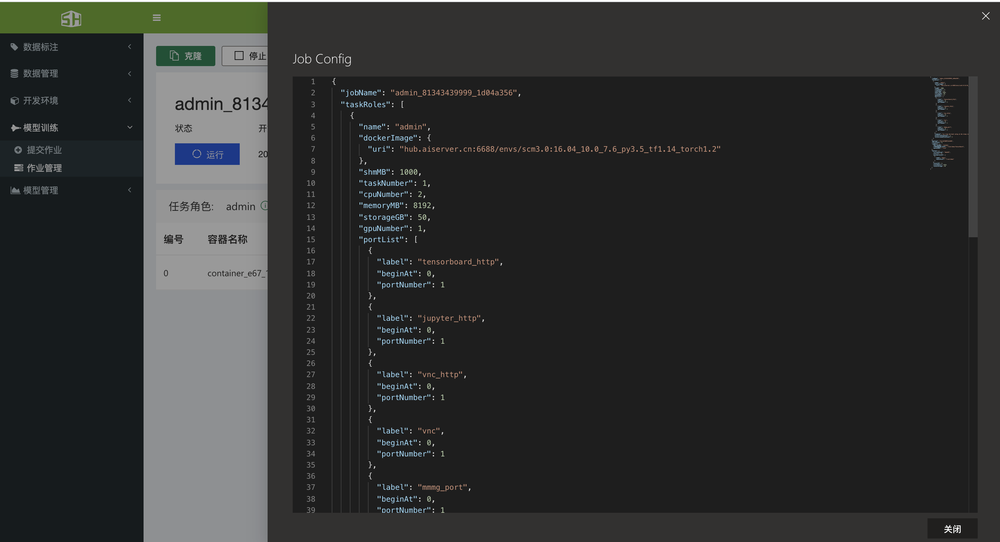
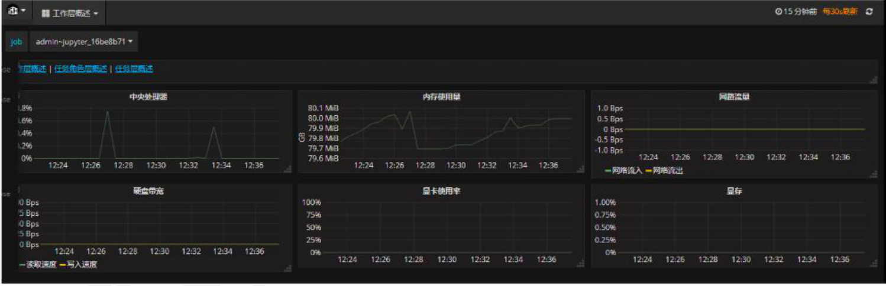
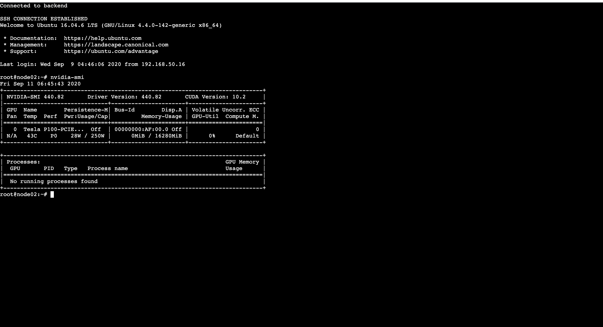
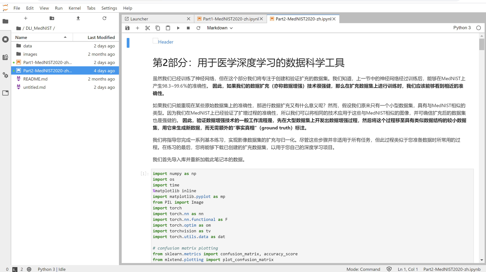
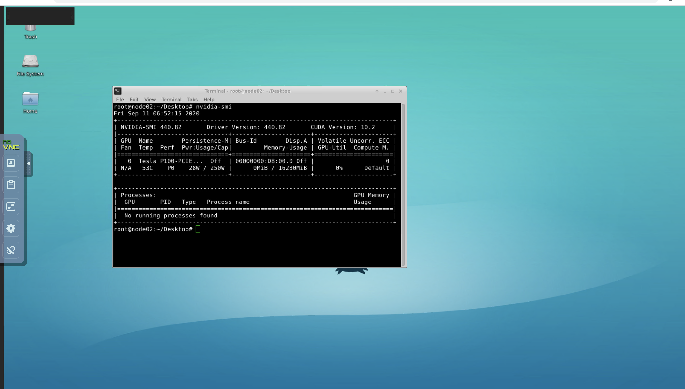
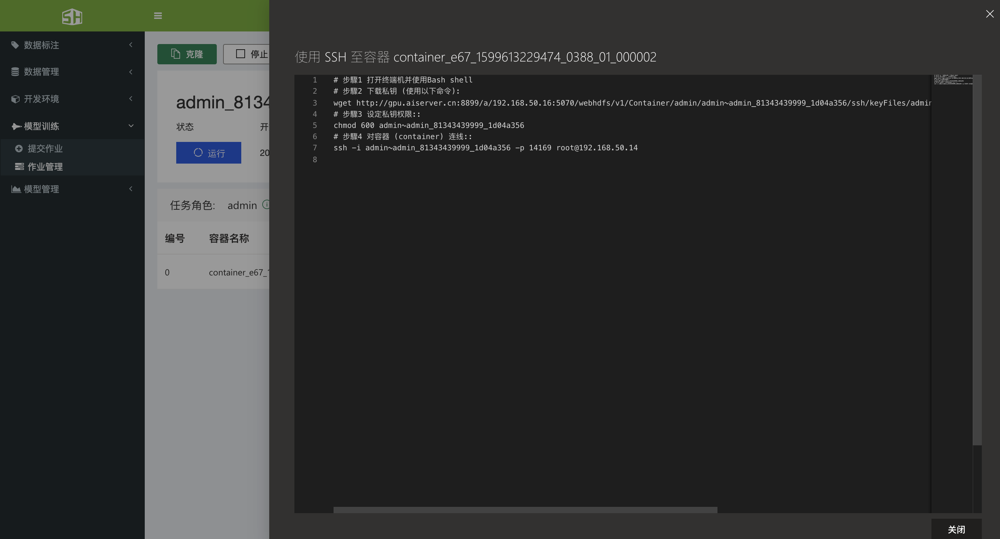
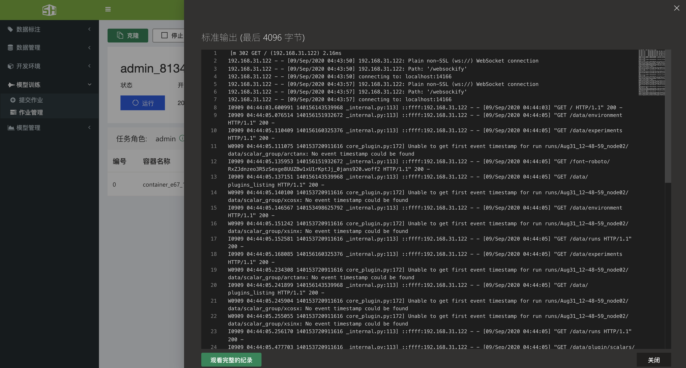

### 6、模型训练

#### 6.1、提交作业
&ensp;&ensp;提交作业分为 3 中方式，即通过表单提交作业、通过粘贴 JSON 文件提交作业和通过导入 JSON 文件提交作业。

###### 6.1.1、概念介绍

&ensp;&ensp;在提交第一个作业之前，先让我们了解些关于 SCM 系统的基本概念。 

&ensp;&ensp;如图 8.1 所示，在硬件层次上，集群（cluster）由节点（node）组成，通过 docker 技术可将一台 node 虚拟出多台主机。在提交任务的层次上，作业（job）可以划分为多个task-role，每个 task-role 可以有多个相同配置的 task，每个 task 是独立的 docker 容器，运行 job 分配的任务。 

###### 6.1.1.1、单机任务 

&ensp;&ensp;当我提交个单机单卡/单击多卡的作业时，scm 启动一个/多个 docker 容器，并将 CPU，内存和一块 GPU 等资源分配给 docker 容器。然后，我们就可以使用这台轻量级的虚拟机跑任务。在集群中某一台节点上提交作业（job-1），job-1 只有一种任务角色（task-role），且此 task-role 包含两个任务（work），两个 work 运行在同一台主机的两块显卡上。 

###### 6.1.1.2、分布式任务

&ensp;&ensp;当我们提交个多机多卡的任务时，scm 启动多个 docker 容器（每个容器相当于一个task），这些容器可在同一台主机或在不同主机上，并将 CPU，内存和一块 GPU 等资源分配给每个 docker 容器。然后，我们就可以使用这些轻量级的虚拟机跑任务。在集群中某一台节点上提交作业（job-2），job-2 有 main、work 两种任务角色（task-role），共有三个任务（work），三个 work 运行在两台主机的三块显卡上。

##### 6.1.2、通过表单提交作业——推荐使用
###### 6.1.2.1.1、未开启专业模式

&ensp;&ensp;单击模型训练--提交作业进入提交作业界面。 

&ensp;&ensp;在未打开专业设置之前，提交作业共分为基本设置和任务设置两个部分。
+ 基本设置
&ensp;&ensp;需要填写“作业名称”、所使用的“集群”和显卡类别三种信息， 当鼠标滑动到感叹号上会显示提示信息。

+ 任务设置
&ensp;&ensp;需要填写任务名称、需要使用的命令(默认为：sleep infinity)、共享内存大小、使用的CPU与GPU数量、使用的Docker镜像，以及对外暴露的端口。

&ensp;&ensp;填写完成后点击提交作业，会弹出确认配置窗口，确认配置无误后点击提交即可。

###### 6.1.2.1.2、开启专业模式

&ensp;&ensp;开启专业模式后，会出现其他选项，比如用户可以自定义选择作业需要的内存、CPU、GPU数量、添加环境变量、挂载存储空间等选项。

&ensp;&ensp;用户可以通过存储配置选项，将分布式存储和集中式存储挂载到作业中，会将分布式存储与集中式存储中的数据和代码映射到容器当中 。
&ensp;&ensp; 环境变量部分可以设定一些特殊的环境变量。

##### 6.1.3、通过编辑 JSON 文件提交作业

&ensp;&ensp;点击提交作业页面中的“编辑 JSON”按钮，会弹出当前配置的JSON文件，可以以 JSON 形式修改提交表单中的内容，同时也可以将完整的 json 文件替换已有内容。

##### 6.1.4、通过导入 JSON 文件提交作业
&ensp;&ensp;点击提交作业页面中的“导入”按钮，可以选择一个 json 文件导入进来完成表单填充。

#### 6.2、作业管理

&ensp;&ensp;SCM人工智能云平台提供训练作业管理功能，包括查看和修改作业运行状态（等待、运行、错误、终止、完成等）、作业快速克隆。 SCM人工智能云平台提供作业的日志查看功能，可以查看从提交作业到作业结束等所有状态的日志信息，支持训练过程中输出损失率、准确率等动态可视化监控图表，同时支持实时输出训练过程日志，并提供日志下载功能，方便用户调试。 

+ 作业信息查看及状态修改 
+ 监控作业/日志查看 
+ 高级服务（Jupyter、Tensorboard、远程桌面等）

##### 6.2.1、查看作业信息

&ensp;&ensp;点击模型训练-》作业管理进入作业管理界面，可以查看当前用户所提交的作业，以及作 业的提交时间、提交用户、运行时间、所在集群、运行状态等信息。

##### 6.2.2、**管理作业** 

&ensp;&ensp;单击动作下的按钮，可以停止作业、删除作业、设定工作时长等。

##### 6.2.3、**监控作业**、查看作业日志、高级服务

+ 单击作业名称，即可进入作业的详细信息。

+ 单击“JSON 文件”可以查看当前作业的 JSON

+ 单击“作业监控”可以以图形化的方式查看当前作业对硬件资源的使用情况。

  

+ 单击“网页 SSH”可以以 web ssh 方式进入容器 

  

+ 单击”即时改码“可即打开 Jupyter 

+ 单击”远程桌面“可以打开远程桌面 

+ 单击”日志监控“可以打开 TensorBoard 

+ 单击“SSH”可以获取连接 SSH 的密钥 

  

+ 单击"标准输出"可以查看当前作业日志，然后单击**观看完整的记录**可以查看完整的日志。 

  

#### 6.3、参数介绍
##### 6.3.1、环境变量
&ensp;&ensp;作业（job）中的每个任务（task）都在一个 Docker 容器中运行。对于多任务作业 （multi-task），一个任务（task）可能与其他任务（task）通信。因此，任务（task）需要 了解其他任务（task）的运行时信息，如 IP，端口等。系统将此类运行时信息作为环境变量 公开给每个任务的 Docker 容器。为了相互通信，用户可以在容器中编写代码来访问那些运 行时环境变量。这些环境变量也可以在作业配置文件中使用。 下面将展示 Docker 容器中可访问的环境变量的完整列表：

|类别|环境变量名称|描述|
|-|-|-|
|Job level | PAI_JOB_NAME |作业名称，由 JSON 中 jobName 设定|
||PAI_USER_NAME |提交这个作业的用户名|
||PAI_DEFAULT_FS_URI |默认的文件系统的 URI|
|Task role level |PAI_TASK_ROLE_COUNT| 任务角色（task-role）的数量|
||PAI_TASK_ROLE_LIST |配置文件中的所有任务角色名称（逗号分割）|
||PAI_TASK_ROLE_TASK_COUN T_$taskRole |任务角色的任务数量|
||PAI_HOST_IP_$taskRole_$taskI ndex |指定$taskRole_$taskIndex 的主机 IP|
||PAI_PORT_LIST_$taskRole_$ta skIndex_$portType |$taskRole_$taskIndex 指定主机的端口|
||PAI_RESOURCE_$taskRole |配置文件中（类似“gpuNumber，cpuNumber，memMB， shmMB”） 任务角色的资源需求|
||PAI_MIN_FAILED_TASK_COUN T_$taskRole |任务角色中的 taskRole.minFailedTaskCount|
||PAI_MIN_SUCCEEDED_TASK_ COUNT_$taskRole |任务角色中的 taskRole.minSucceededTaskCount|
|Current task role |PAI_CURRENT_TASK_ROLE_N AME |当前任务角色的名称|
|Current task |PAI_CURRENT_TASK_ROLE_C URRENT_TASK_INDEX| 当前任务角色中当前任务的索引，从 0 开始|

##### 6.3.2、Job配置文件(关键字说明)
&ensp;&ensp;json 文件描述了作业提交所需的详细配置。详细格式如下：

|字段名称|格式|描述|
|-|-|-|
|jobName String|（正则表达式： ^[A-Za-z0-9\-._~]+$）,必须填写 （requred）| 作业名称，值唯一|
|image |String,requred| Docker 镜像的 URL|
|authFile |String, optional（选择填写）| HDFS URI Docker registry authentication file existing on HDFS|
|dataDir |String, optional |HDFS URI Data directory existing on HDFS|
|outputDir |String, optional |HDFS URI Output directory on HDFS, $PAI_DEFAULT_FS_URI/Output/$jobName will be used if not specified|
|codeDir |String, optional |HDFS URI Code directory existing on HDFS, should not contain any data and should be less than 200MB. codeDir will created to your job container local environment and could be accessed inner job container. NOTE: this folder is readonly|
|virtualCluster |String, optional |The virtual cluster job runs on. If omitted, the job will run on default virtual cluster|
|taskRoles |List, required |任务角色列表，至少有一个|
|taskRole.name| String（^[A-Za-z0-9._~]+$), required |任务角色的名称，唯一|
|taskRole.taskNumber| Integer, required |同一任务角色下的任务熟练，大于等于 1|
|taskRole.cpuNumber |Integer, required |每个任务分配的 CPU 核数大于等于 1|
|taskRole.memoryMB| Integer, required |每个任务所分配的内存，大于等于 100MB|
|taskRole.shmMB| Integer, optional| 每个任务所分配的共享内存大小，默认值是 64MB|
|taskRole.gpuNumber |Integer, required |每个任务所分配的 GPU 数量，大于等于 0|
|taskRole.portList |List, optional |portType 使用清单|
|taskRole.portType.label| String（^[A-Za-z0-9._~]+$), required |端口类型的标签名称|
|taskRole.portType.beginAt| Integer, required |端口类型中的端口，0 表示随机选择|
|taskRole.portType.portNumber |Integer, required |特定类型的端口数|
|taskRole.command |String, required |任务角色中任务的可执行命令，不能为空|
|taskRole.minFailedTaskCount |Integer, optional |Number of failed tasks to fail the entire job, null or no less than 1, if set to null means the job will always succeed regardless any task failure.|
|taskRole.minSucceededTaskCount| Integer, optional |Number of succeeded tasks to succeed the entire job, null or no less than 1, if set to null means the job will only succeed until all tasks are completed and minFailedTaskCount is not triggered.|
|gpuType |String, optional |指定要在任务中使用的 GPU 类型。如果省略，作业将在任何 gpu 类型上运行|
|retryCount |Integer, optional |作业重试次数不低于 0|
|jobEnvs |Object, optional |作业 env 参数，键值对，在作业容器中可用且不允许替换|
|jobEnvs.isDebug |Boolean, optional |将此标志设置为 true，如果用户的命令以非零值退出，则将保 留故障容器以进行作业调试。|
|extras |Object, optional |额外参数，键值对，保存作业可能使用的任何信息|
