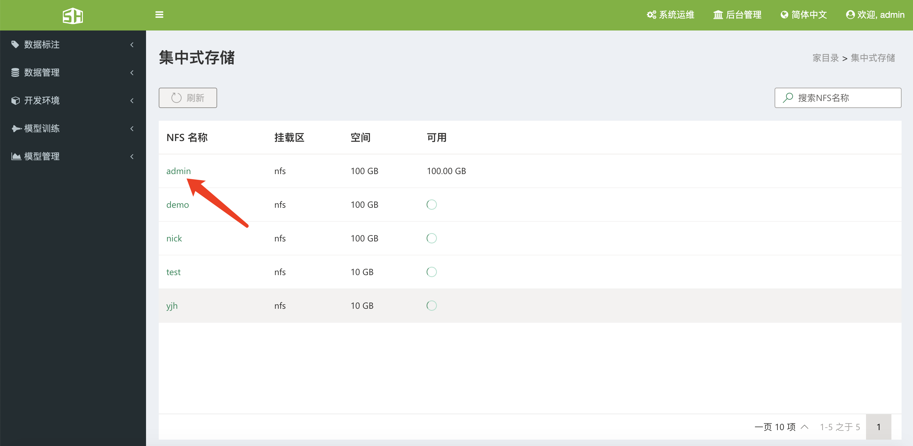
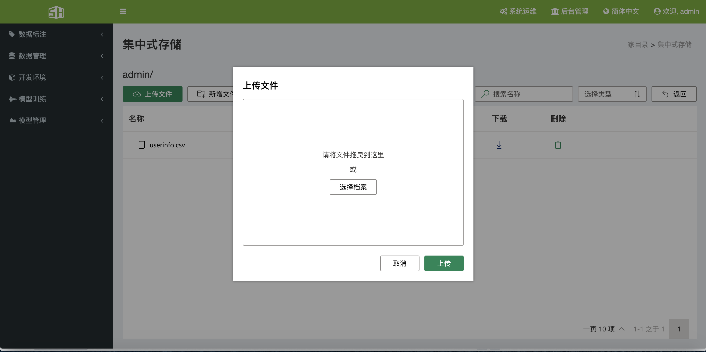
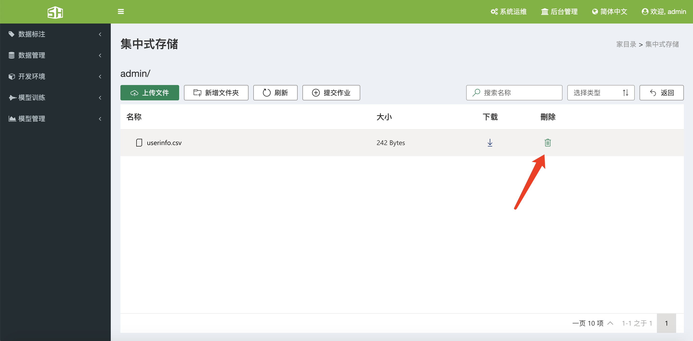
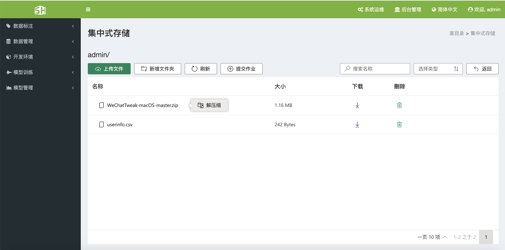
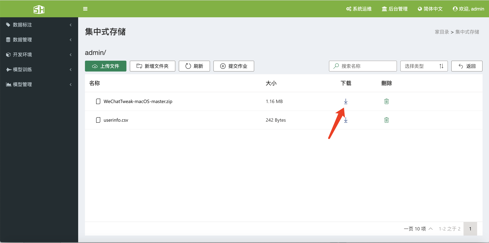
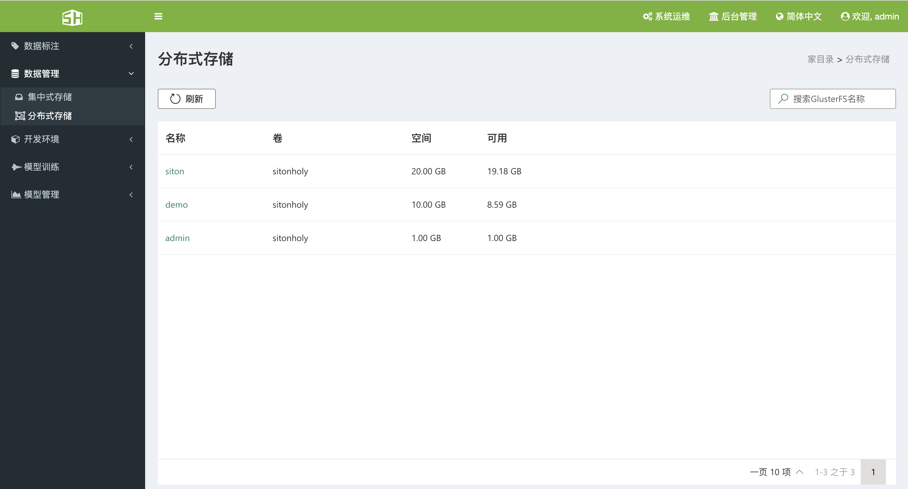
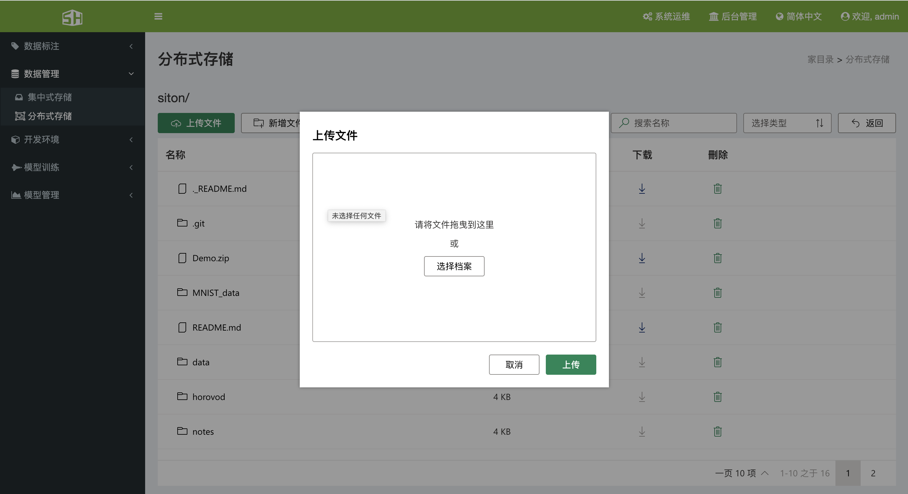
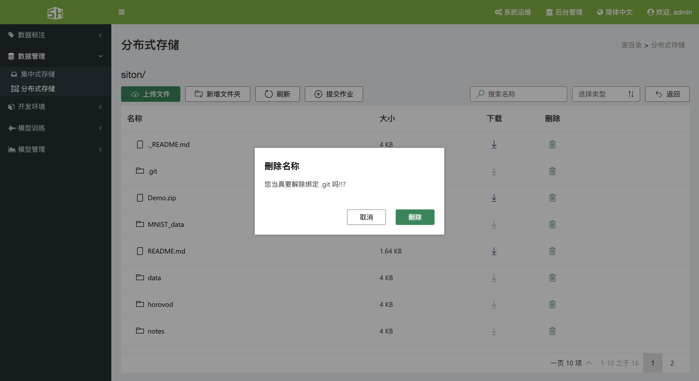
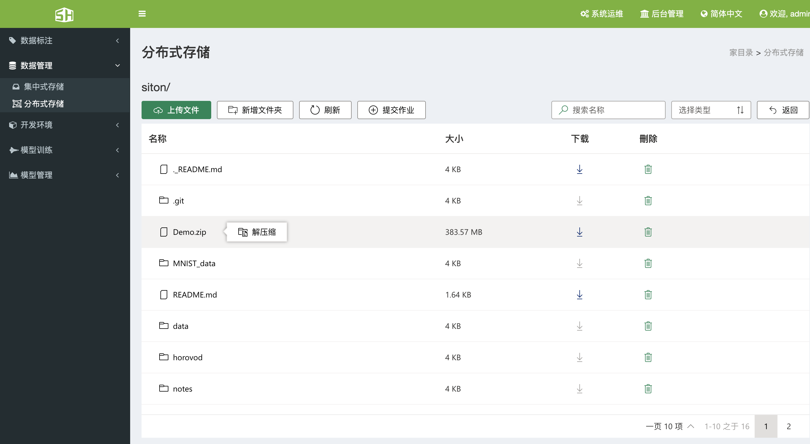
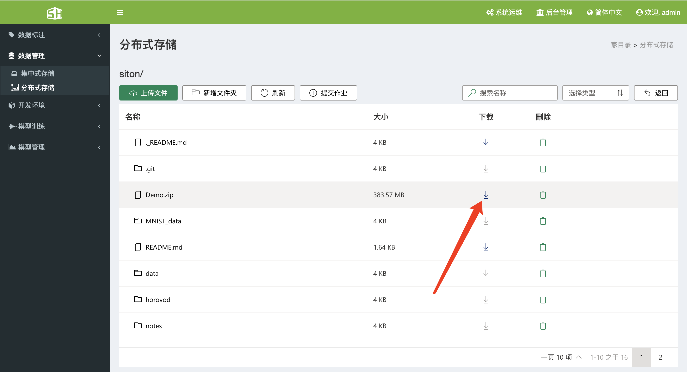

### 4、数据管理

&ensp;&ensp;SCM人工智能云平台，为用户提供了方便的数据管理功能，用户可以很方便的通过SCM人工智能云平台访问存储中的文件，同时支持 infiniband 高速通信，其过程与访问本地存储时一样简单快速。
&ensp;&ensp;点击“数据管理“->“集中式存储“可看到当前用户的所有挂载区，点击NFS名称，可进入具体的操作页面。

#### 4.1、集中式存储

##### 4.1.1、查看

&ensp;&ensp;单击“数据管理”->“集中式存储”可进入当前用户的集中式存储操作界面。

##### 4.1.2、文件上传

&ensp;&ensp;在集中式存储界面点击名称，即可跳转到详细页面，在此页面中，点击上传文件，会弹出文件上传页面，可以点击选择档案或者将文件拖拽到文件上传页面，然后点击确定。

#####  4.1.3、文件删除

&ensp;&ensp;在集中式存储的详细页面，点击删除按钮，即可删除当前文件。

##### 4.1.4、文件解压缩

&ensp;&ensp;在集中式存储的详细页面，在文件名称上单击鼠标右键，选择解压缩，文件会自动在后台解压缩。

##### 4.1.5、文件下载

&ensp;在集中式存储的详细页面，点击下载按钮，即可下载对应的文件。

#### 4.2、分布式存储

##### 4.2.1、查看

&ensp;&ensp;单击“数据管理”->“分布式存储”可进入当前用户的分布式存储操作界面。

##### 4.2.2、文件上传

&ensp;&ensp;在分布式存储界面点击NFS名称，即可跳转到详细页面，在此页面中，点击上传文件，会弹出文件上传页面，可以点击选择档案或者将文件拖拽到文件上传页面，然后点击确定。

##### 4.2.3、文件删除

&ensp;&ensp;在分布式存储的详细页面，点击删除按钮，即可删除当前文件。

##### 4.2.4、文件解压缩

&ensp;&ensp;在分布式存储的详细页面，在文件名称上单击鼠标右键，选择解压缩，文件会自动在后台解压缩。

##### 4.2.5、文件下载

&ensp;&ensp;在分布式存储的详细页面，点击下载按钮，即可下载对应的文件。

