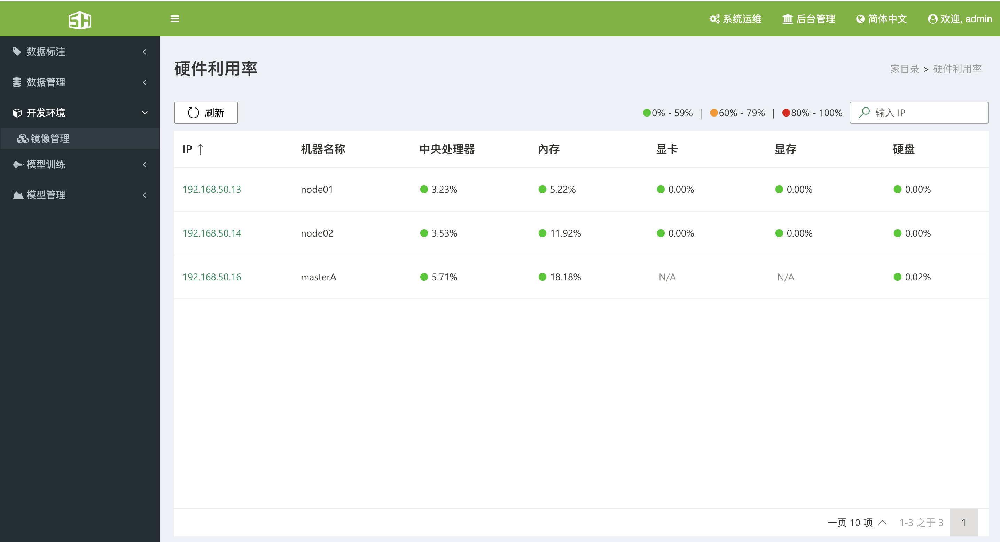
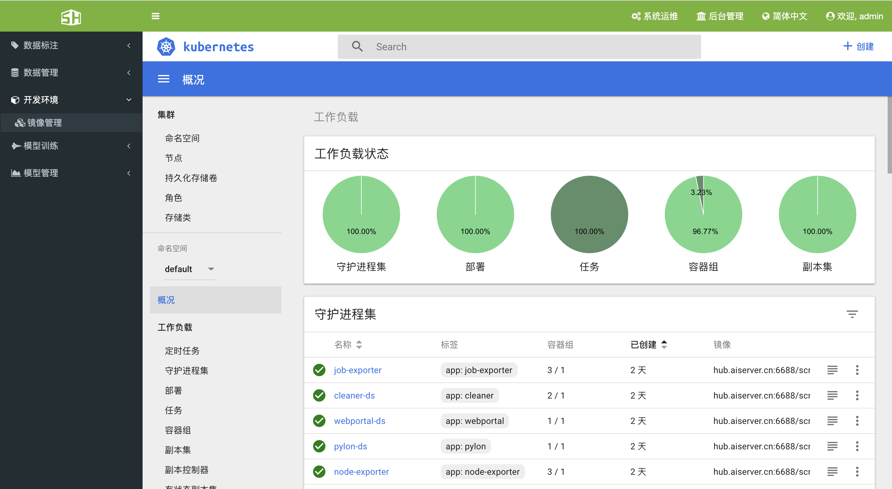
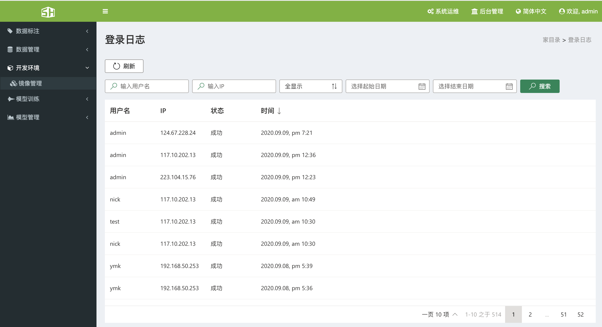
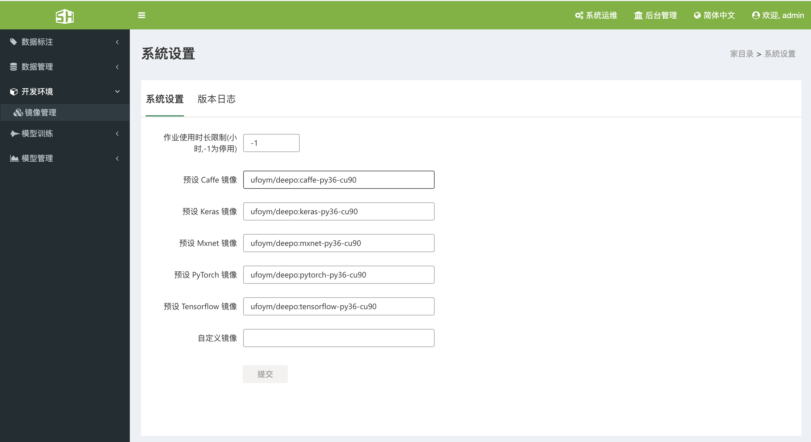
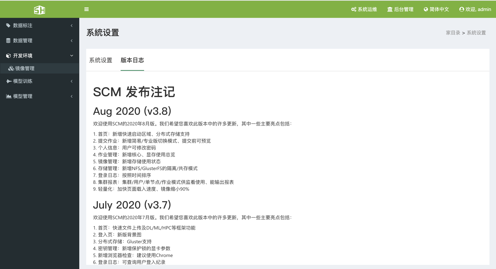

### 8、系统运维

#### 8.1、硬件利用率

&ensp;&ensp;点击系统运维-》硬件利用率，可以查看当前集群内机器的CPU、内存、GPU、显存、硬盘、网络的使用情况。

#### 8.2、K8S仪表板

&ensp;&ensp;点击系统运维-》K8S仪表板，可以查看K8S的环境运行状态。

#### 8.3、集群报表

#### 8.4、登录日志

&ensp;&ensp;点击系统运维-》登录日志，可以查看用户的登录信息，包括：登录IP地址、登录状态、时间等。

#### 8.5、系统设置

##### 8.5.1、基本设置

&ensp;&ensp;此页面为全局设置，可以显示作业使用时长和预设镜像。作业显示时长填写-1为停用。

##### 8.5.2、版本日志

&ensp;&ensp;通过版本日志，可以查看当前SCM的更新状态。

